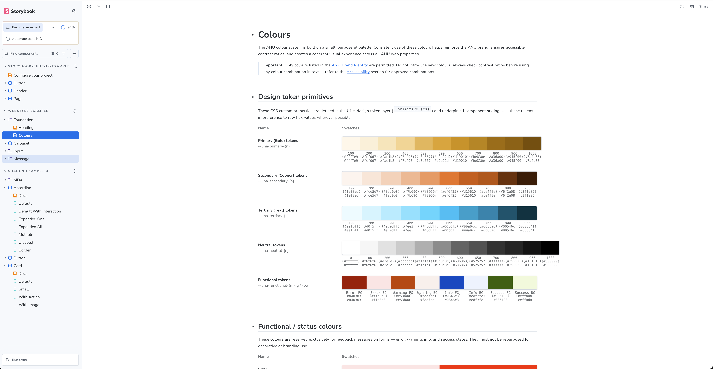

This is a demo Storybook project with three sets of examples:

- **STORYBOOK-BUILT-IN-EXAMPLE**:
  - examples that came with Storybook `npm` installation
  - using:
    - Native CSS (`.storybook/storybook-examples/*.css`)
    - React Functional Component (`.storybook/storybook-examples/*.tsx`)
- **WEBSTYLE-EXAMPLE**:
  - example of component using ANU CSS library in style server
    - https://github.com/anu-its/sew-websites-webstyle
    - https://webpublishing.anu.edu.au/web-style-guide
- **SHADCN-EXAMPLE-UI**:
    - examples of using ShadCN component with Storybook
    - using:
        - Tailwind (`app/gloabl-tailwind-shadcn.css`)
        - ShadCN (`components.json`, `components/ui/*.tsx`)

You can run the project via running the following:

-   `npm install && npm run storybook-dev`

Or preview its built version on Chromatic:

- [https://main--6aaa16a7f29e25aff39f17b6.chromatic.com](https://main--6aaa16a7f29e25aff39f17b6.chromatic.com/)